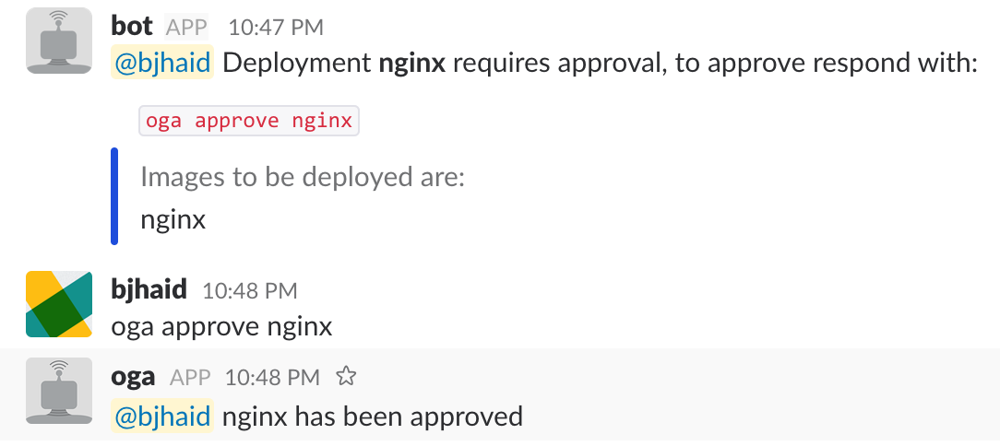

# Oga

_Let the bots deploy and the humans approve._

Oga is a [Kubernetes
intiializer](https://kubernetes.io/docs/admin/extensible-admission-controllers/#configure-initializers-on-the-fly)
that blocks a deployment from initializing and requests approval from
slack(this is can be extended with different requesters in the future see
[fake_requester](initializer/fake_requester.go) as an example) before allowing
the deployment to continue.

## Usage

- Create the initializer resource in k8s e.g:
```bash
$> kubectl apply -f examples/initializer.yaml
```

Run the bot:

```
$> ./oga -bot-name oga -slack-token "<SLACK TOKEN>"`
```

_this will be updated with a k8s deployment in the future_

On deployments that require approval define the below annotation on them:

```yaml
metadata:
  annotations:
    "initializer.kubernetes.io/oga": |
      slack:
        channel: "#testoga"
        approvers:
          - "@bjhaid"
```

Apply the deployment and you should get a message like below in slack if it's
configured correctly:


On successful approval oga will update the deployment metadata as below:

```yaml
  metadata:
    annotations:
      deployment.kubernetes.io/revision: "1"
      initializer.kubernetes.io/oga: |
        approved_by: |
          Username: bjhaid, Fullname: Ayodele, Email: bjhaid@oga.com
        slack:
          approvers:
          - '@bjhaid'
          channel: '#testoga'
```

Including the details of the person who responded to the approval request on the annotation.

If you need to override `oga`'s approval request for any reason you can declare
an empty initializer on your deployment configuration as below:

```yaml
metadata:
  initializers:
  annotations:
    "initializer.kubernetes.io/oga": |
      slack:
        channel: "#testoga"
        approvers:
          - "@bjhaid"
```

**Note this will remove all initializers including `oga`**

```bash
Usage of ./oga:
  -alsologtostderr
        log to standard error as well as files
  -annotation string
        The annotation to trigger initialization (default "initializer.kubernetes.io/oga")
  -bot-name string
        The username of the oga bot as created in slack
  -initializer-name string
        The initializer name (default "oga.initializer.kubernetes.io")
  -kubeconfig string
        (optional) absolute path to the kubeconfig file (default "/Users/bjhaid/.kube/config")
  -log_backtrace_at value
        when logging hits line file:N, emit a stack trace
  -log_dir string
        If non-empty, write log files in this directory
  -logtostderr
        log to standard error instead of files
  -slack-token string
        Slack API token
  -stderrthreshold value
        logs at or above this threshold go to stderr
  -v value
        log level for V logs
  -vmodule value
        comma-separated list of pattern=N settings for file-filtered logging
```

## TODO:
- [ ] Add k8s configuration files for deploying oga to k8s.
- [ ] Add support for slack groups.
- [ ] High Availability of oga, currently can run only a single oga instance.
